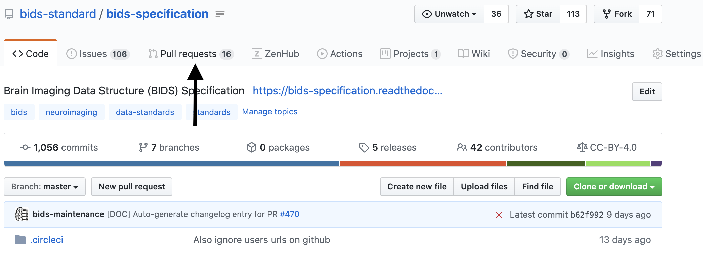
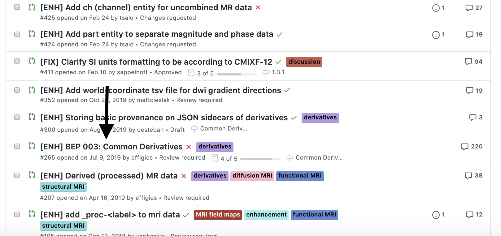
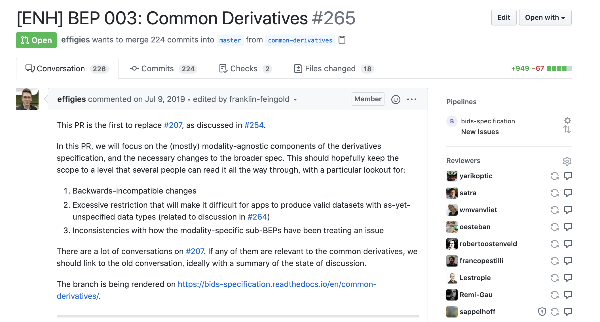
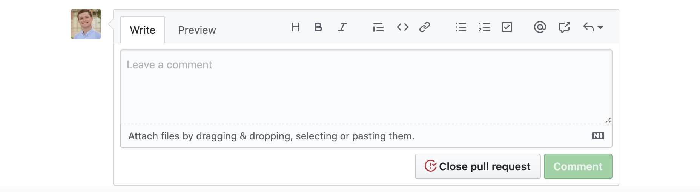
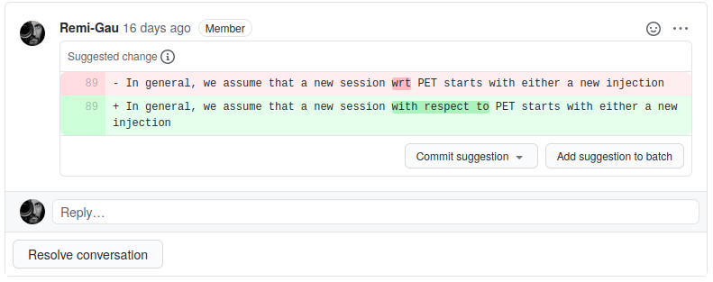
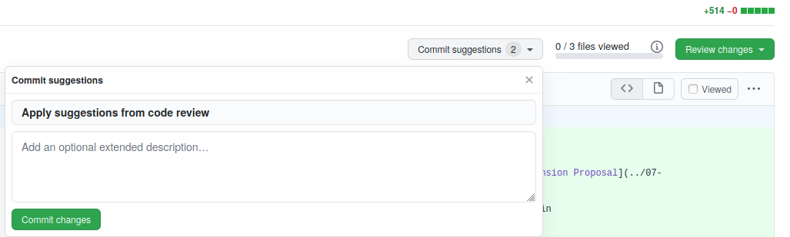
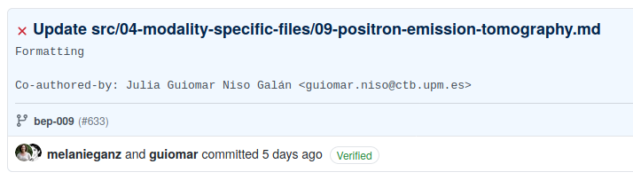

## Table of Contents

**Contributing to the CPP-repositories**

This was in large part taken and adapted from the `CONTRIBUTING.md` from the
BIDS-specification.

If you have any questions that aren't discussed below, please let us know by
[opening an issue](#understanding-issues).

Been here before? Already know what you're looking for in this guide? Jump to
the following sections:

- [Table of Contents](#table-of-contents)
- [Contributing through GitHub](#contributing-through-github)
- [Understanding issues](#understanding-issues)
- [Making a change with a pull request](#making-a-change-with-a-pull-request)
    - [2. Fork [this repository](https://github.comcpp-lln-lab/CPP_BIDS) to your profile](#2-fork-this-repository-to-your-profile)
    - [3. Make the changes you've discussed](#3-make-the-changes-youve-discussed)
    - [4. Submit a pull request](#4-submit-a-pull-request)
- [Example pull request](#example-pull-request)
- [Commenting on a pull request](#commenting-on-a-pull-request)
  - [Navigating to open pull requests](#navigating-to-open-pull-requests)
  - [Pull request description](#pull-request-description)
  - [Generally commenting on a pull request](#generally-commenting-on-a-pull-request)
  - [Specific comments on a pull request](#specific-comments-on-a-pull-request)
    - [Suggesting text](#suggesting-text)
- [Accepting suggestion from a review](#accepting-suggestion-from-a-review)
- [Code style guide and quality](#code-style-guide-and-quality)
  - [Matlab](#matlab)
  - [Keeping your code clean with pre-commit](#keeping-your-code-clean-with-pre-commit)
- [How to run the tests](#how-to-run-the-tests)
  - [Install MoxUnit](#install-moxunit)
  - [Run the tests](#run-the-tests)
  - [Code coverage](#code-coverage)
  - [Adding more tests](#adding-more-tests)
- [Writing documentation](#writing-documentation)
  - [Quick start on using sphinx](#quick-start-on-using-sphinx)
  - [Setting up conf.py for matlab doc](#setting-up-confpy-for-matlab-doc)
  - [reStructured text markup](#restructured-text-markup)
  - ["Templates"](#templates)
  - [Get the filenames of all the functions in a folder](#get-the-filenames-of-all-the-functions-in-a-folder)
  - [Build the documentation locally](#build-the-documentation-locally)
  - [Build the documentation with Read the Docs](#build-the-documentation-with-read-the-docs)
  - [Other matlab projects that use](#other-matlab-projects-that-use)
    - [Sphinx](#sphinx)
    - [Read the docs](#read-the-docs)
- [Recognizing contributions](#recognizing-contributions)

<!--
TODO: sections to add / update

Move the different READMEs (notebooks) into this document, and keep the READMES
into the different folder to simply redirect to this document

- examples
  - setting up an octave jupyter notebook
- binder
- continuous integration
-->

## Contributing through GitHub

[Git](https://git-scm.com/) is a really useful tool for version control.
[GitHub](https://github.com/) sits on top of git and supports collaborative and
distributed working.

We know that it can be daunting to start using git and GitHub if you haven't
worked with them in the past, but the BIDS-matlab maintainers are here to help
you figure out any of the jargon or confusing instructions you encounter!

In order to contribute via GitHub you'll need to set up a free account and sign
in. Here are some
[instructions](https://help.github.com/articles/signing-up-for-a-new-github-account/)
to help you get going. Remember that you can ask us any questions you need to
along the way.

## Understanding issues

Every project on GitHub uses
[issues](https://github.com/cpp-lln-lab/CPP_BIDS/issues) slightly differently.

The following outlines how BIDS developers think about communicating through
issues.

**Issues** are individual pieces of work that need to be completed or decisions
that need to be made to move the project forwards. A general guideline: if you
find yourself tempted to write a great big issue that is difficult to describe
as one unit of work, please consider splitting it into two or more issues.

Issues are assigned [labels](#issue-labels) which explain how they relate to the
overall project's goals and immediate next steps.

    - [ Issue labels

The current list of labels are
[here](https://github.com/cpp-lln-lab/CPP_BIDS/labels) and include:

- [](https://github.com/bids-standard/cpp-lln-lab/CPP_BIDS/opinions%20wanted)
  _These issues hold discussions where we're especially eager for feedback._

  Ongoing discussions benefit from broad feedback. This label is used to
  highlight issues where decisions are being considered, so please join the
  conversation!

<!-- TODO:
- add more issue labels description -->

## Making a change with a pull request

We appreciate all contributions to the BIDS Specification. **THANK YOU** for
helping us build this useful resource.

     - [ 1. Comment on an existing issue or open a new issue referencing your addition

This allows other members of the team to confirm that you aren't overlapping
with work that's currently underway and that everyone is on the same page with
the goal of the work you're going to carry out.

#### 2. [Fork](https://help.github.com/articles/fork-a-repo/) [this repository](https://github.comcpp-lln-lab/CPP_BIDS) to your profile

This is now your own unique copy of the repository. Changes here won't affect
anyone else's work, so it's a safe space to explore edits to the code!

Make sure to
[keep your fork up to date](https://help.github.com/articles/syncing-a-fork/)
with the master repository, otherwise you can end up with lots of dreaded
[merge conflicts](https://help.github.com/articles/about-merge-conflicts/).

#### 3. Make the changes you've discussed

Try to keep the changes focused. If you submit a large amount of work in all in
one go it will be much more work for whomever is reviewing your pull request.
Please detail the changes you are attempting to make.

#### 4. Submit a [pull request](https://help.github.com/articles/about-pull-requests/)

Please keep the title of your pull request short but informative.

<!-- It will appear in the [changelog](src/CHANGES.md). -->

Use one of the following prefixes in the title of your pull request:

- `[ENH]` - enhancement of the specification that adds a new feature or support
  for a new data type
- `[FIX]` - fix of a typo or language clarification
- `[INFRA]` - changes to the infrastructure automating the specification release
  (for example, building HTML docs)
- `[MISC]` - everything else including changes to the file listing contributors

If you are opening a pull request to obtain early feedback, but the changes are
not ready to be merged (also known as a "work in progress" pull request,
sometimes abbreviated by `WIP`) please use a
[draft pull request](https://github.blog/2019-02-14-introducing-draft-pull-requests/).

A member of the team will review your changes to confirm that they can be merged
into the main codebase.

A [review](https://help.github.com/articles/about-pull-request-reviews/) will
usually consist of a few questions to help clarify the work you've done. Keep an
eye on your GitHub notifications and be prepared to join in that conversation.

You can update your [fork](https://help.github.com/articles/about-forks/) and
the pull request will automatically update with those commits. You don't need to
submit a new pull request when you make a change in response to a review.

GitHub has a [nice introduction](https://help.github.com/articles/github-flow/)
to the pull request workflow, but please [get in touch](#get-in-touch) if you
have any questions.

## Example pull request


## Commenting on a pull request

Our primary method of adding to or enhancing our code base occurs in the form of
[pull requests](https://help.github.com/articles/about-pull-requests/).

This section outlines how to comment on a pull request.

### Navigating to open pull requests

The list of pull requests can be found by clicking on the "Pull requests" tab in
the repository.



<!-- ### Selecting an open pull request

In this example we will be navigating to our
[??? pull request](https://github.com/cpp-lln-lab/CPP_BIDS/pull/???).

 -->

### Pull request description

Upon opening the pull request we see a detailed description of what this pull
request is seeking to address. Descriptions are important for reviewers and the
community to gain context into what the pull request is achieving.



### Generally commenting on a pull request

At the bottom of the pull request page, a comment box is provided for general
comments and questions.



### Specific comments on a pull request

The proposed changes to the text of the specification can be seen in the "Files
changed" tab. Proposed additions are displayed on a green background with a `+`
before each added line. Proposed deletions are displayed on a red background
with a `-` before each removed line. To comment on a specific line, hover over
it, and click the blue plus sign (pictured below). Multiple lines can be
selected by clicking and dragging the plus sign.


#### Suggesting text

Comments on lines can contain "suggestions", which allow you to propose specific
wording for consideration. To make a suggestion, click the plus/minus (±) icon
in the comment box (pictured below).


Once the button is clicked the highlighted text will be copied into the comment
box and formatted as a
[Markdown code block](https://help.github.com/en/github/writing-on-github/creating-and-highlighting-code-blocks).


The "Preview" tab in the comment box will show your suggestion as it will be
rendered. The "Suggested change" box will highlight the differences between the
original text and your suggestion.


A comment may be submitted on its own by clicking "Add single comment". Several
comments may be grouped by clicking "Start a review". As more comments are
written, accept them with "Add review comment", and submit your review comments
as a batch by clicking the "Finish your review" button.

## Accepting suggestion from a review

When others are making [suggestions to your pull request](#suggesting-text), you
have the possibility to accept directly the changes suggested during the review
through the github interface. This can often be faster and more convenient than
make the changes locally and then pushing those changes to update your pull
request. Moreover it gives the opportunity to give credit to the reviewers for
their contribution.

To do this, you must click on the `Files changed` tab at the top of the page of
a pull request.


From there you can browse the different files changed and the 'diff' for each of
them (what line was changed and what the change consist of). You can also see
comments and directly change suggestions made by reviewers.

You can add each suggestion one by one or group them together in a batch.



If you decide to batch the suggestions to add several of them at once, you must
scroll back to the top of the 'Files changed' page and the `commit suggestions`
button will let you add all those suggestions as a single commit.



Once those suggestions are committed the commit information should mention the
reviewer as a co-author.



## Code style guide and quality

### Matlab

In most cases we use a `camelCase` to name our functions and variables.

We use the [MISS_HIT linter](https://github.com/florianschanda/miss_hit/) to
automatically enforce / fix some code style issues and check for code quality.

The linter is a python package that can be installed with:

```
pip3 install --user miss_hit
```

The rules followed by the miss_hit are in the
[miss_hit configuration file](./miss_hit.cfg).

To check the code style of the whole repository, you can can simply type:

```
mh_style .
```

Some styling issues can be automatically fixed by using the `--fix` flag. You
might reuquire to rerun this command several times if there are a lot of issues.

```
mh_style . --fix
```

Code quality can be checked with:

```
mh_metric .
```

To see only the issues that "break" the code quality rules set in the
configuration file, type:

```
mh_metric . --ci
```

The code style and quality is also checked during the
[continuous integration](.github/workflows/miss_hit.yml).

For more information about the miss_hit see its
[documentation](https://florianschanda.github.io/miss_hit/).

### Keeping your code clean with pre-commit

[Pre-commit](https://pre-commit.com/) is a python package to can help you check
that your code or your markdown document is properly formatted before committing
it.

- Install it:

```
pip install pre-commit
```

- Add a `.pre-commit-config.yaml` in the root folder of your repo. The content
  oif this file for typical matlab linting with miss_hit will look like the one
  below.
- Install a "git hook" with `pre-commit install`: the "hook" is a little script
  added to the `.git/hooks` folder that will be run when you perform certain git
  commands.
- You are done. Now when you run `git commit`, pre-commit will run checks on
  your files and either will fix them automatically if it can, or will tell you
  to fix them. Once you have fixed all the problems you just need to stage those
  changes with `git add` and commit everything with `git commit`

```yml
repos:
  # to use miss hit for matlab
  - repo: local

    hooks:
      - id: mh_version
        name: mh_version
        entry: mh_style
        args: [-v]
        verbose: true
        language: python
        additional_dependencies: [miss_hit_core]

      - id: mh_style
        name: mh_style
        entry: mh_style
        args: [--process-slx, --fix]
        files: ^(.*\.(m|slx))$
        language: python
        additional_dependencies: [miss_hit_core]

      - id: mh_metric
        name: mh_metric
        entry: mh_metric
        args: [--ci]
        files: ^(.*\.(m|slx))$
        language: python
        additional_dependencies: [miss_hit_core]

      - id: mh_lint
        name: mh_lint
        entry: mh_lint
        files: ^(.*\.(m|slx))$
        language: python
        additional_dependencies: [miss_hit]

  # other generic checks for formatting and linting
  - repo: https://github.com/pre-commit/pre-commit-hooks
    rev: v2.0.0
    hooks:
      - id: trailing-whitespace
      - id: end-of-file-fixer
      - id: check-yaml
      - id: check-added-large-files
```

## How to run the tests

<!-- TODO:

- Add a section on why tests are needed and what purpose they serve.
Mostly add some links to the relevant sources.
 -->

### Install MoxUnit

You need to install
[MOxUnit for matlab and octave](https://github.com/MOxUnit/MOxUnit) to run the
tests.

Note the install procedure will require you to have
[git](https://git-scm.com/downloads) installed on your computer. If you don't,
you can always download the MoxUnit code with this
[link](https://github.com/MOxUnit/MOxUnit/archive/master.zip).

Run the following from a terminal in the folder where you want to install
MOxUnit. The `make install` command will find Matlab / Octave on your system and
make sure it plays nice with MoxUnit.

```bash
# get the code for MOxUnit with git
git clone https://github.com/MOxUnit/MOxUnit.git
# enter the newly created folder and set up MoxUnit
cd MOxUnit
make install
```

If you want to check the code coverage on your computer, you can also install
[MOcov for matlab and octave](https://github.com/MOcov/MOcov). Note that this is
also part of the continuous integration of the bids-matlab, so you don't need to
do this.

Install [MOcov for matlab and octave](https://github.com/MOcov/MOcov) to get the
code coverage

### Run the tests

Make sure you are in the `tests` directory.

Run `moxunit_runtests` or `moxunit_runtests -verbose` to run the tests.

This will tell you which tests pass or fail.

### Code coverage

The following command would give more info and will give you HTML output in a
`coverage_html` folder showing you which lines of code is or is not checked by
your test suite.

```matlab
success = moxunit_runtests(pwd, ... % the path where the tests are
    '-verbose', ...
    '-with_coverage', ...
    '-cover', fullfile(pwd, '..'), ... % the path of the code whose coverage we want to estimate
    '-cover_xml_file','coverage.xml', ...
    '-cover_html_dir','coverage_html');
```

This will return a clear underestimation of the code coverage as the the code in
dependencies in the `lib` folder are also included in this report.

If you want to get a slightly more accurate estimate you should run the
following.

I have not been able to find a way to exclude certain files without breaking
some tests.

```matlab
coverage = mocov( ...
    '-expression', 'moxunit_runtests()', ...
    '-verbose', ...
    '-cover', fullfile(pwd, '..'), ...
    '-cover_exclude', '*jsonread.m', ...
    '-cover_xml_file','coverage.xml', ...
    '-cover_html_dir','coverage_html')
```

### Adding more tests

You can use the following function template to write more tests.

```matlab
function test_suite = test_functionToTest()
    % This top function is necessary for mox unit to run tests.
    % DO NOT CHANGE IT except to adapt the name of the function.
    try % assignment of 'localfunctions' is necessary in Matlab >= 2016
        test_functions = localfunctions(); %#ok<*NASGU>
    catch % no problem; early Matlab versions can use initTestSuite fine
    end
    initTestSuite;
end

function test_functionToTestBasic()

    %% set up


    %% data to test against


    %% test
    % assertTrue( );
    % assertFalse( );
    % assertEqual( );

end

function test_functionToTestUseCase1()

    %% set up


    %% data to test against


    %% test
    % assertTrue( );
    % assertFalse( );
    % assertEqual( );

end
```

## Writing documentation

We use Sphinx to automatically write the Read-The-Doc documentation of our code
from the content of the "help" section of each `.m` file.

Setting up sphinx requires you to install the following python packages:

```
Sphinx
sphinxcontrib-matlabdomain
sphinxcontrib-napoleon
sphinx_rtd_theme
```

Those dependencies are usually mentioned in the `requirements.txt` of each repo,
so you just need to use `pip install` (preferably in a virtual environment like
shown in the example below).

```bash
virtualenv -p /usr/bin/python3 env
source env/bin/activate

pip install -r requirements.txt
```

### Quick start on using sphinx

See the [sphinx doc](https://www.sphinx-doc.org/en/master/usage/quickstart.html)
for more.

This
[blog post](https://medium.com/@richdayandnight/a-simple-tutorial-on-how-to-document-your-python-project-using-sphinx-and-rinohtype-177c22a15b5b)
is also useful.

If you are starting a new doc from scratch you can just do the following.

```bash
mkdir docs
cd docs
sphinx-quickstart # launch a basic interactive set up of sphinx
```

And the answer the questions on prompt.

### Setting up conf.py for matlab doc

Following the documentation from
[matlabdomain for sphinx](https://github.com/sphinx-contrib/matlabdomain).

Specify the extensions you are using:

```python
extensions = [
    'sphinxcontrib.matlab',
    'sphinx.ext.autodoc']
```

`matlab_src_dir` in `docs/source/conf.py` should have the path (relative to
`conf.py`) to the folder containing your matlab code:

```python
matlab_src_dir = os.path.dirname(os.path.abspath('../../src'))
```

### reStructured text markup

reStructured text mark up primers:

- on the
  [sphinx site](https://www.sphinx-doc.org/en/master/usage/restructuredtext/basics.html)

- more
  [python oriented](https://pythonhosted.org/an_example_pypi_project/sphinx.html)

- typical doc strings templates
  - [google way](https://www.sphinx-doc.org/en/master/usage/extensions/example_google.html)
  - [numpy](https://www.sphinx-doc.org/en/master/usage/extensions/example_numpy.html#example-numpy)

### "Templates"

For most repos there are templates to use for `.m` files in the `src/templates`
folder that show how to format your help sections.


```matlab
function y = my_function(arg1, arg2)
    %
    % Describe what the function does here.
    %
    % USAGE::
    %
    %   y = my_function_napoleon(arg1, arg2)
    %
    % :param arg1: The first input value
    % :type arg1: The first input value
    % :param arg2: The second input value
    % :type arg2: The second input value
    %
    % :returns: The input value multiplied by two

    y = arg1 + arg2
```

You then just need to insert this in your `.rst` file for the documentation to
be done automatically.

```rst

.. automodule:: src.folder_name .. <-- This is necessary for auto-documenting the rest

.. autofunction:: function to document

```

### Get the filenames of all the functions in a folder

- The dirty way

```bash
ls -l src/*.m | cut -c42- | rev | cut -c 3- | rev
```

Increase the `42` to crop more characters at the beginning.

Change the `3` to crop more characters at the end.

- the smart way

```bash
find folder_path -type f -name "*.m" \
     -exec sh -c 'for f do basename -- "$f" ;done' sh {} +
```

### Build the documentation locally

From the `docs` directory:

```bash
sphinx-build -b html source build
```

This will build an html version of the doc in the `build` folder.

Usually the sphinx set-up will create a `Makefile` that will make your life
easier.

Type `make help` to see which type of output you can create. This will for
example tell you that the sphinx command above can be replace by `make html`.

### Build the documentation with Read the Docs

Add a [`.readthedocs.yml`](../.readthedocs.yml) file in the root of your repo.

See [HERE](https://docs.readthedocs.io/en/stable/config-file/v2.html) for
details.

You can then trigger the build of the doc by going to the
[read the docs website](https://readthedocs.org).

You might need to be added as a maintainer of the doc.

The doc can be built from any branch of a repo.

### Other matlab projects that use

#### Sphinx

Some are listed
[sphinx-contrib/matlabdomain#users](https://github.com/sphinx-contrib/matlabdomain#users)

#### Read the docs

-   [qMRLab](https://github.com/qMRLab/qMRLab/wiki/Guideline:-Generating-Documentation)


## Recognizing contributions

For most repositories we follow the
[all-contributors](https://github.com/kentcdodds/all-contributors)
specification, so we welcome and recognize all contributions from documentation
to testing to code development. You can see a list of current contributors in
the [README](./README.md).

If you have made any type of contributions, we will add you as a contributor (or
ask to be added if we forgot).
